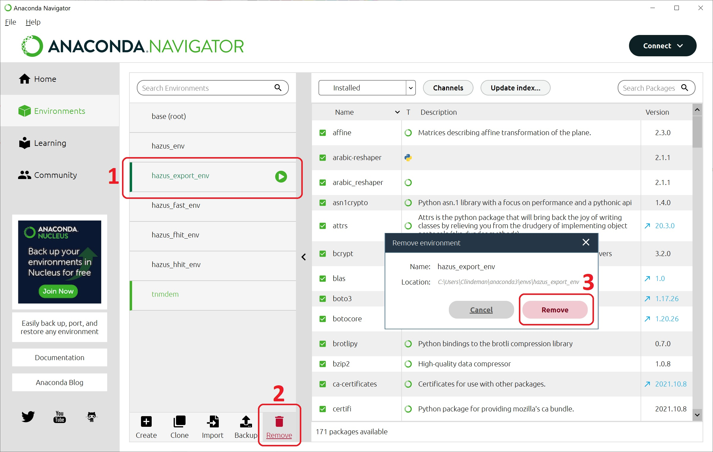

# Environment-Setup
Instructions on how to set up a Python environment to run NHRAP-HAZUS Open Source tools.

## Requirements

Each NHRAP Hazus open source tool has their own requirements however each tool will require Python. ArcGIS Desktop includes Python 2.7 which is used to install conda. Some older tool versions require Anaconda be installed. Anaconda can be installed alongside Miniforge however if you do not have Anaconda installed then follow the Steps to Install Conda below.

## Documentation
* [Conda](https://docs.conda.io/en/latest/) is a free software package manager that automatically manages all Python packages required to run Hazus open source tools.
* [Miniforge](https://github.com/conda-forge/miniforge) is a community driven minimalistic conda installer.

## Steps to install conda using Miniforge
1. Download this repository as a zipfile
    
2. Unzip the download folder and run the python script install-miniforge.py by double-clicking it
    
3. Download and run any of the NHRAP-HAZUS Open Source tools.
    * Each tool has it's own environment.yaml file that conda will use to create a virtual environment with the required Python libraries.

## Steps to uninstall conda 
1. FIXME

## Steps to uninstall Miniforge
1. FIXME

## Steps to install Anaconda
It is not recommended to use Anaconda as its not supported in the latest versions of the NHRAP-HAZUS Open Source Tools. This is kept for posterity.
1. ~~Go to https://www.anaconda.com/distribution/~~
2. ~~Download Anaconda for Python 3~~
3. ~~Complete the installation. During installation, make sure the following options are checked:~~
    - [x] ~~Add Anaconda to my PATH environment variable~~
    - [x] ~~Register Anaconda as my default Python~~
    - [x] ~~Install Anaconda for local user, rather than all users~~

## Steps to Uninstall a NHRAP-HAZUS Open Source tool
1. Delete the tool's folder

## Steps to uninstall Anaconda
Older versions of the NHRAP HAZUS open source tools use Anaconda to install and manager the Python environment(s). It is recommended to uninstall the older versions and Anaconda and use the latest tool versions with Miniforge.

1. Using Anaconda, delete any virtual environments
    * This can be done via the Anaconda program interface or via [terminal window or Anaconda Prompt](https://docs.conda.io/projects/conda/en/latest/user-guide/tasks/manage-environments.html#removing-an-environment).
    * Via Anaconda Program Interface:
      1. Open Anaconda.
      2. Select the 'hazus_env' or 'hazus_\<tool acronym\>_env'.
      3. Click the 'Remove' button.
      4. A popup will appear asking you to confirm. Click the 'Remove' button. This may take a few minutes.
      5. Repeat steps 2 - 3 until all 'hazus_...' virtual environments are removed.
      
    * Via terminal window:
      1. Open a command line prompt
      2. Enter the following without qoutes 'conda info --envs' to see your environments. 'hazus_env' should be listed.
      3. Enter the following without quotes 'conda env remove --name hazus_env' to remove the environment. This may take a few minutes.
      4. Enter the following without qoutes 'conda info --envs' to see your environments again and hazus_env should not be listed.
      5. Repeat steps 2 - 3 until all 'hazus_...' virtual environments are removed.
      

2. Follow the [uninstall steps](https://docs.anaconda.com/anaconda/install/uninstall/) from Anaconda 
    * It is recommended to perform the 'Option B. Full uninstall using Anaconda-Clean and simple remove.'

## Contact

Issues can be reported through this [repository](https://github.com/nhrap-hazus/Environment-Setup) on Github.

For questions contact fema-hazus-support@fema.dhs.gov
